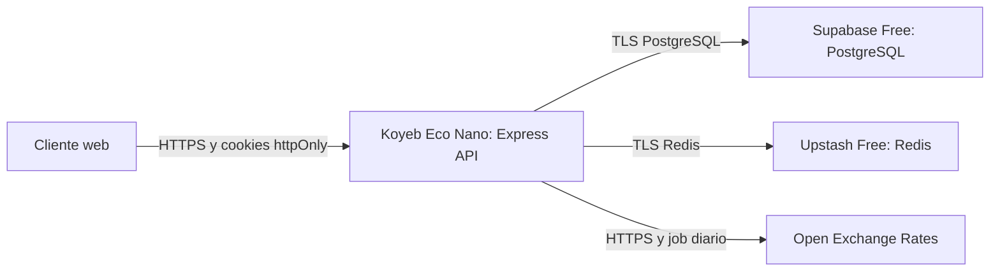

# Despliegue inicial: Koyeb, Supabase y Upstash

Fecha de decisión: 2026-10-01.

## Decisión

Usar una instancia **Koyeb Eco Nano** para la API Express, Supabase Free para
PostgreSQL y Upstash Free para Redis. Eco Nano es el primer gasto operativo
aceptado: Koyeb la publica a USD 1.61 por mes al momento de esta decisión. El
precio y los límites se revisan antes de contratar o renovar.

La instancia Eco Nano tiene 0.1 vCPU y 256 MB de RAM. Es apropiada para una
primera instancia única con tráfico bajo. Node, Prisma y el cliente Redis
comparten esa memoria; si se observan reinicios, errores por memoria, latencia
sostenida o `readiness` inestable, se pasa a Eco Micro antes de añadir usuarios
o réplicas.

Esta elección evita la suspensión tras inactividad de la instancia gratuita de
Koyeb. La disponibilidad continúa limitada a una instancia y a los planes Free
de los servicios administrados.

## Topología

Seleccionar regiones próximas entre sí. La primera opción es Washington D.C.
para Koyeb, una región de Supabase próxima en US East y una base Upstash en
`us-east-1`. Si una cuenta no ofrece esa combinación, se elige un conjunto
equivalente en Europa antes de crear recursos; no se mezclan continentes por
comodidad de la consola.

## Límites que condicionan el diseño

| Servicio | Límite inicial | Consecuencia operativa |
| --- | --- | --- |
| Koyeb Eco Nano | 0.1 vCPU, 256 MB RAM, una instancia | No habilitar réplicas ni autoscaling. Vigilar memoria y reinicios. |
| Supabase Free | 500 MB por proyecto; puede pausarse tras baja actividad | Mantener copias de seguridad y comprobar la disponibilidad antes de una demo o lanzamiento. |
| Upstash Free | 256 MB, 500 000 comandos/mes y 10 GB de transferencia | Usar TTL para caché de tasas y vigilar comandos; no usarlo todavía para rate limit distribuido. |

Las cifras se basan en la documentación vigente de [Koyeb
Instances](https://www.koyeb.com/docs/reference/instances), [Supabase
Billing](https://supabase.com/docs/guides/platform/billing-on-supabase) y
[Upstash Redis pricing](https://upstash.com/pricing/redis). La pausa de
proyectos Free de Supabase está descrita en su guía de [Free project
pausing](https://supabase.com/docs/guides/platform/free-project-pausing).

## Plan de puesta en marcha

### 1. Crear recursos y alinear regiones

1. Crear el proyecto Supabase y guardar su URL de PostgreSQL como secreto.
2. Crear la base Upstash en la misma región y guardar su URL TLS `rediss://`
   como secreto.
3. Crear el servicio Koyeb Eco Nano y confirmar el precio mostrado antes de
   activarlo.
4. Configurar alertas de facturación y revisar el panel de consumo de Upstash.

Criterio de salida: las conexiones a PostgreSQL y Redis funcionan desde un
entorno de prueba sin exponer secretos en el repositorio ni en logs.

### 2. Preparar los datos de producción

1. Completar las variables de producción de [`.env.example`](../.env.example)
   en los secretos de la plataforma, incluyendo `DATABASE_URL`, `REDIS_URL`,
   claves JWT, `CORS_ORIGINS` y las credenciales de Open Exchange Rates.
2. Ejecutar una única vez `prisma migrate deploy` como tarea de migración.
   Nunca ejecutar `db push`, `migrate reset` ni seeds sobre esa base.
3. Ejecutar `npm run rates:refresh` con las credenciales configuradas para
   inicializar las tasas que consumirá el dashboard desde caché.

Criterio de salida: las migraciones terminan sin error, existen tasas
persistidas y los datos existentes no se han modificado fuera de la migración
revisada.

### 3. Configurar el servicio Koyeb

1. Desplegar un commit o imagen inmutable ya validado por CI.
2. Configurar una única Eco Nano, `NODE_ENV=production` y un periodo de
   graceful shutdown de al menos 30 segundos.
3. Usar `/api/v1/health` como health check y `/api/v1/ready` para comprobar
   PostgreSQL y Redis antes de aceptar tráfico.
4. Configurar el dominio HTTPS y limitar `CORS_ORIGINS` a los orígenes reales
   del cliente web.

Criterio de salida: Koyeb marca la instancia saludable y `ready` responde 200
con PostgreSQL y Redis disponibles.

### 4. Abrir tráfico y observar

1. Realizar el flujo de registro, login, refresh de token y logout en el dominio
   final.
2. Crear suscripciones USD y EUR, y confirmar que summary y analytics
   concilian sus importes.
3. Confirmar que una caída de Redis deja `health` en 200 y `ready` en 503.
4. Observar logs, reinicios, memoria, tiempos de respuesta y consumo de Upstash
   durante las primeras 24 horas.

Criterio de salida: no hay reinicios ni errores de memoria, el readiness se
mantiene estable y el consumo de Redis queda holgadamente dentro del plan Free.

## Criterio para subir de instancia

Cambiar a Eco Micro antes de ampliar el acceso si hay reinicios, errores de
memoria, `ready` inestable o uso sostenido de memoria cercano al límite de 256
MB. El cambio se programa como un despliegue normal: mantener las mismas
variables, desplegar la imagen validada, comprobar health y readiness, y repetir
el smoke test del paso 4.

Este primer diseño no habilita autoscaling ni múltiples instancias. Esas mejoras
dependen de completar los elementos v1.1 ya documentados: rate limit compartido,
coordinación del job de tasas y observabilidad de métricas/tracing.

La lista general de preparación de release sigue en
[deploy-checklist.md](deploy-checklist.md).
